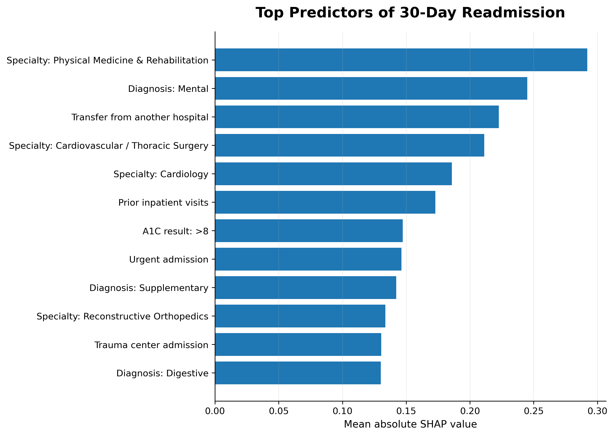
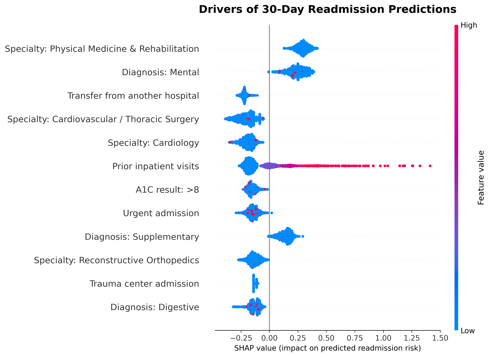
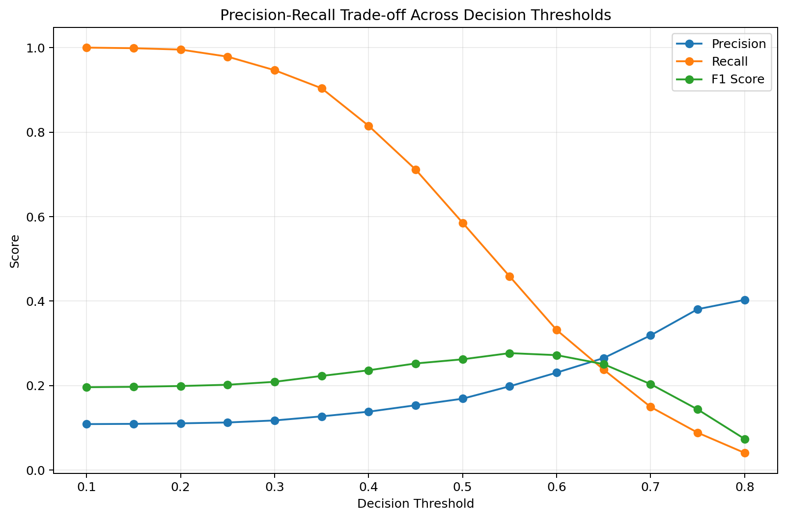

# Diabetes 30-Day Readmission Prediction

A machine learning project predicting whether a patient with diabetes will be **readmitted to the hospital within 30 days**.

This project uses the **UCI Diabetes 130-US Hospitals dataset** and focuses on building an interpretable machine learning pipeline with **XGBoost, patient-level validation, leakage analysis, threshold evaluation, and SHAP explainability**.

---

## Project Overview

Hospital readmission is an important healthcare quality and resource-management problem.

The goal of this project is to identify patterns associated with **30-day hospital readmission** using patient demographics, diagnoses, hospital utilization, medications, laboratory results, and admission information.

Rather than focusing only on predictive performance, this project also examines:

- **Patient-level data leakage**
- **Class imbalance**
- **Potentially dominant discharge-related variables**
- **High-cardinality categorical features**
- **Decision threshold tradeoffs**
- **Model interpretability with SHAP**

The final model uses an **XGBoost classifier** on a cleaned and carefully preprocessed patient cohort.

---

## Dataset

**Source:** UCI Machine Learning Repository  
**Dataset:** Diabetes 130-US Hospitals for Years 1999–2008

The original dataset contains **101,766 hospital encounters** and includes:

- Patient demographics
- Admission information
- Hospital utilization history
- Diagnoses
- Medications
- Laboratory results
- Readmission outcomes

The prediction target is:

- **1** — Readmitted within 30 days
- **0** — Not readmitted within 30 days

The raw dataset is not included in this repository.

Place the dataset at:

```text
data/diabetic_data.csv
```

---

## Data Preparation

### 1. Patient-Level Train/Test Split

Some patients appear in the dataset multiple times.

Instead of randomly splitting individual encounters, the dataset is split using **`patient_nbr` as the grouping variable**.

This prevents encounters from the same patient from appearing in both the training and test sets and reduces patient-level leakage.

---

### 2. Cohort Cleaning

Patients with expired or hospice-related discharge outcomes were removed because these encounters are not appropriate for ordinary 30-day readmission prediction.

| Cohort | Encounters |
|---|---:|
| Original dataset | **101,766** |
| Removed expired/hospice encounters | **2,423** |
| Final cohort | **99,343** |

The cleaned cohort had a **30-day readmission rate of approximately 11.4%**.

---

### 3. Leakage Analysis

Initial SHAP analysis showed that **discharge disposition** was one of the strongest drivers of model predictions.

Because discharge-related information can be closely tied to whether a patient is realistically eligible for future readmission, I tested models both **with and without `discharge_disposition_id`**.

For the final model, `discharge_disposition_id` was excluded from the predictive feature set to reduce reliance on discharge-status information.

---

### 4. Rare Medical Specialty Grouping

The original `medical_specialty` variable contained many rare categories.

Specialties appearing fewer than **200 times in the training set** were grouped into an **`Other`** category.

This reduced the dimensionality of the feature space while maintaining nearly identical predictive performance.

The final preprocessing pipeline produced **103 encoded features**.

---

## Modeling

Two primary models were evaluated:

- **Logistic Regression**
- **XGBoost**

XGBoost showed slightly stronger predictive performance and was selected for the final model.

Class imbalance was handled using **`scale_pos_weight`**, calculated from the ratio of negative to positive examples in the training data.

---

## Baseline Model Comparison

Earlier model development showed the following performance:

| Model | ROC-AUC | PR-AUC | Precision | Recall | F1 |
|---|---:|---:|---:|---:|---:|
| Logistic Regression | 0.666 | 0.205 | 0.170 | 0.538 | 0.258 |
| XGBoost | **0.676** | **0.214** | 0.169 | **0.585** | **0.262** |

These results were generated before the final leakage-reduction and cohort-cleaning decisions.

---

## Final Model Performance

The final model uses:

- **XGBoost**
- **Patient-level train/test splitting**
- **Expired/hospice cohort removal**
- **Rare specialty grouping**
- **Discharge disposition exclusion**
- **Class-imbalance weighting**

| Metric | Score |
|---|---:|
| **ROC-AUC** | **0.642** |
| **PR-AUC** | **0.203** |
| **Precision** | **0.165** |
| **Recall** | **0.539** |
| **F1 Score** | **0.253** |

At the default decision threshold of **0.50**, the model identifies approximately **54% of actual 30-day readmissions**.

Because readmission is an imbalanced outcome, **PR-AUC and recall** are especially useful alongside ROC-AUC.

---

## Model Explainability

### Top Predictors

The following plot shows the features with the highest average absolute SHAP values.



Important predictive signals included:

- Medical specialty
- Mental-health-related diagnosis group
- Transfer from another hospital
- **Prior inpatient visits**
- A1C result
- Admission type

One of the clearest interpretable patterns was **prior inpatient utilization**.

Patients with a higher number of previous inpatient visits generally received a higher predicted probability of 30-day readmission.

---

### Direction of Feature Effects

The SHAP beeswarm plot shows both **feature importance** and the **direction of each feature's contribution** to predicted readmission risk.



A particularly clear pattern appears for **Prior inpatient visits**:

- Lower values generally push predictions toward lower readmission risk.
- Higher values strongly push predictions toward higher readmission risk.

> **Note:** SHAP values describe how variables influence the model's predictions. They should not be interpreted as causal relationships.

---

## Threshold Analysis

The default classification threshold was **0.50**, but additional thresholds were evaluated to understand the precision-recall tradeoff.



Example results:

| Threshold | Precision | Recall | F1 |
|---|---:|---:|---:|
| 0.45 | 0.153 | **0.711** | 0.252 |
| 0.50 | 0.169 | 0.585 | 0.262 |
| 0.55 | **0.198** | 0.458 | **0.277** |

A threshold of **0.55 produced the highest F1 score** in this experiment, while lower thresholds substantially increased recall.

For a real healthcare application, threshold selection would depend on the relative cost of **false negatives versus false positives**, rather than F1 score alone.

---

## Model Development Process

During development, I:

- Built a reproducible preprocessing and modeling pipeline
- Compared **Logistic Regression and XGBoost**
- Used **patient-level splitting** to reduce leakage
- Analyzed class imbalance
- Performed threshold analysis
- Used **SHAP** to inspect model behavior
- Identified potentially dominant discharge-related features
- Removed expired/hospice encounters
- Tested model performance with and without discharge disposition
- Grouped rare medical specialty categories
- Rebuilt the final model using the revised feature set

This iterative process was used to improve **model reliability and interpretability**, rather than simply maximizing a single performance metric.

---

## Repository Structure

```text
diabetes-readmission-prediction/
├── data/
│   └── diabetic_data.csv
├── results/
│   ├── final_model_metrics.csv
│   └── model_comparison.csv
├── src/
│   └── final_model.py
├── visuals/
│   ├── shap_bar_final.png
│   ├── shap_beeswarm_final.png
│   └── threshold_tradeoff.png
├── requirements.txt
└── README.md
```

---

## How to Run

### 1. Clone the repository

```bash
git clone https://github.com/Dongwoon1d/diabetes-readmission-prediction.git
cd diabetes-readmission-prediction
```

### 2. Install dependencies

```bash
pip install -r requirements.txt
```

### 3. Add the dataset

Place the UCI dataset at:

```text
data/diabetic_data.csv
```

### 4. Run the final model

```bash
python src/final_model.py
```

The script will automatically save model results to:

```text
results/final_model_metrics.csv
results/final_model_summary.txt
```

and SHAP visualizations to:

```text
visuals/shap_bar_final.png
visuals/shap_beeswarm_final.png
```

---

## Tools & Technologies

### Programming
- **Python**

### Data Analysis
- **pandas**
- **NumPy**

### Machine Learning
- **scikit-learn**
- **XGBoost**

### Model Explainability
- **SHAP**

### Visualization
- **Matplotlib**

---

## Key Findings

The analysis produced several useful observations:

- **Prior inpatient utilization was one of the strongest interpretable predictors of readmission risk.**
- Higher prior inpatient utilization generally increased predicted 30-day readmission risk.
- Medical specialty and diagnosis categories also contributed substantially to predictions.
- Removing discharge disposition reduced predictive performance, suggesting it contained meaningful predictive information.
- Grouping rare medical specialty categories reduced model complexity while preserving performance.
- SHAP analysis was useful not only for interpretation, but also for identifying potentially problematic features during model development.

---

## Limitations

This project is intended as a **data science portfolio project**, not as a clinical decision-support system.

Important limitations include:

- The dataset was collected between **1999 and 2008**.
- Healthcare practices may have changed substantially since the data was collected.
- The dataset is observational.
- Predictive associations should not be interpreted as causal relationships.
- The model has moderate discrimination and relatively low precision.
- Clinical deployment would require significantly more validation, calibration, fairness analysis, and external testing.

---

## Author

**Dongwoon Han**  
B.S. Data Science, University of Wisconsin–Madison

[GitHub](https://github.com/Dongwoon1d)
